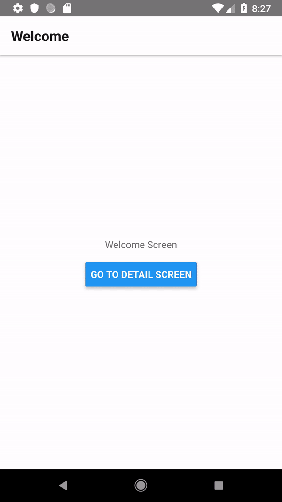

# Sample Project React Navigation 3 + Redux + Android Back Handler
> Sample project demostrating how to handle hardware back button of android with React Navigation 3 and Redux
 
I was exploring the <a href="https://reactnavigation.org/">react navigation</a> library . I have made a sample project with 2 screens. I have implemented redux by reading the <a href="https://reactnavigation.org/docs/en/redux-integration.html"> Docs </a>.
I have realised that while i am on second screen  and pressing hardware back of android and application is closing app instead of going back to first screen.
 
 
 

I was not able to find some sample project which has demostrate  how to handle hardware back button of android with React Navigation 3 and Redux.
So i have created this sample project . Below is Demo of project

 

